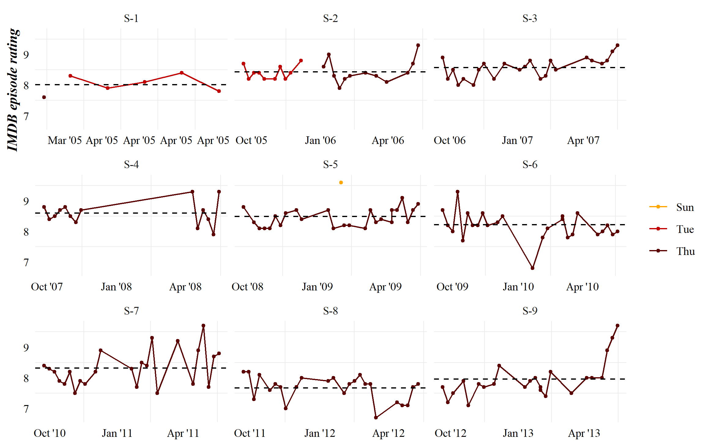
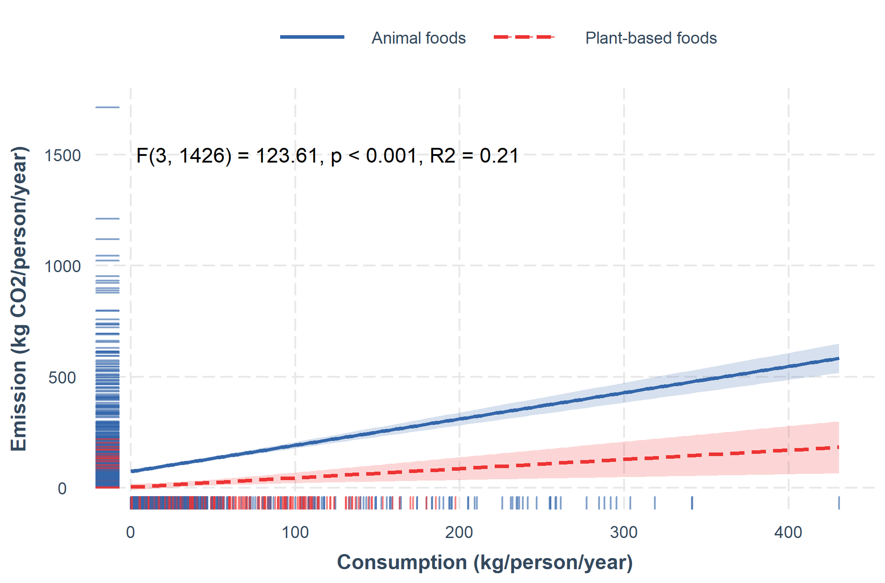

```{r setup, include=FALSE}
library(tufte)

# invalidate cache when the tufte version changes
knitr::opts_chunk$set(echo = FALSE,
                      tidy = FALSE, 
                      message = FALSE,
                      warning = FALSE,
                      cache.extra = packageVersion('tufte'))

options(htmltools.dir.version = FALSE)
```


A collection of plots using data from the #tidytuesday project  

# Public spending on children (2020-09-15)  


```{r, fig.fullwidth = TRUE}
knitr::include_graphics("../plots/2020-09-15-child-spending/pubhealth.png")

```


# Beer production (2020-03-31) 

```{r, fig.fullwidth = TRUE}
knitr::include_graphics("../plots/2020-03-31-beer-production/production-statebin.png")

```


```{r, fig.fullwidth = TRUE}
knitr::include_graphics("../plots/2020-03-31-beer-production/production-dumbbell.png")

```

# TBI (2020-03-24)

```{r, fig.fullwidth = TRUE}


```


```{r,  fig.fullwidth = TRUE}
 knitr::include_graphics("../plots/2020-03-24-tbi/tbi-causes.png")
```


```{r, fig.fullwidth = TRUE}
knitr::include_graphics("../plots/2020-03-24-tbi/mil-tbi.png")
```


# The Office (2020-03-17)

```{r}
knitr::include_graphics("../plots/2020-03-17-the-office/plot2.png")

```

```{r, fig.fullwidth = TRUE}


```


# MMR vaccination (2020-02-25)  

```{r, fig.fullwidth = TRUE}
knitr::include_graphics("../plots/2020-02-25-measles/ny-rates.png")
```


# Food Consumption (2020-02-18)  

```{r, fig.cap="Although CO2 emissions increase with consumption, regardless of food type, an interaction model shows us that on average CO2 emissions are higher with animal-food consumption than with plant-based consumption"}

```


```{r, fig.cap="Using a log-log plot really helps us see the relationship between these variables"}

```


```{r, fig.fullwidth = TRUE}
knitr::include_graphics("../plots/2020-02-18-food-consumption/log-scales.png")
```


# NFL Standings (2020-02-04)


```{r, fig.fullwidth = TRUE}

```

```{r, fig.fullwidth = TRUE}
knitr::include_graphics("../plots/2020-02-04-nfl-attendance/away_attend.jpeg")
```


# Spotify Songs (2020-01-21)


```{r, fig.path="animate/spotify-",  fig.fullwidth = TRUE, eval=FALSE}
library(gganimate)

load("../data/spotify-ggplot.RData")

p1 <- pop_by_year +
  transition_states(year) +
  shadow_mark() +
  enter_grow()

animate(p1,
        renderer = magick_renderer())

```


```{r}
knitr::include_graphics("animate/spotify-unnamed-chunk-1-1.gif")

```


```{r,  fig.fullwidth = TRUE}
knitr::include_graphics("../plots/2020-01-21-spotify/patch_one.png")

```


```{r,  fig.fullwidth = TRUE}
knitr::include_graphics("../plots/2020-01-21-spotify/patch_two.png")

```

